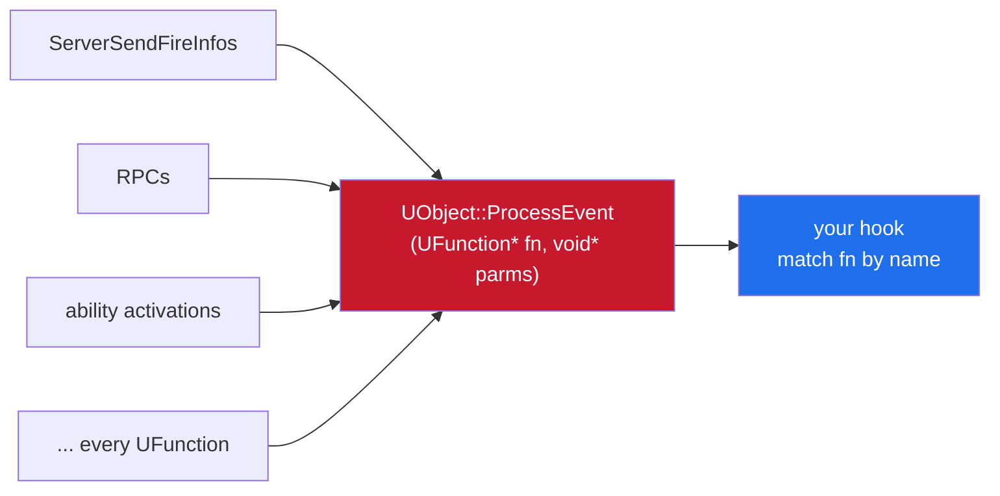
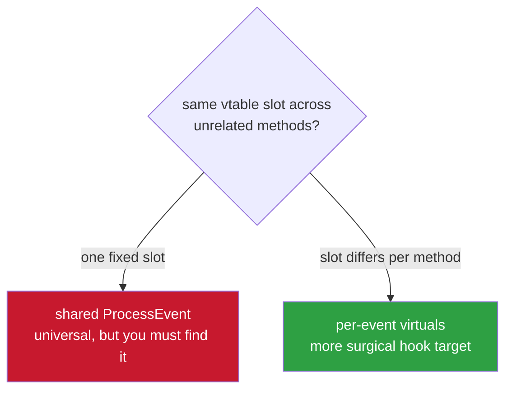
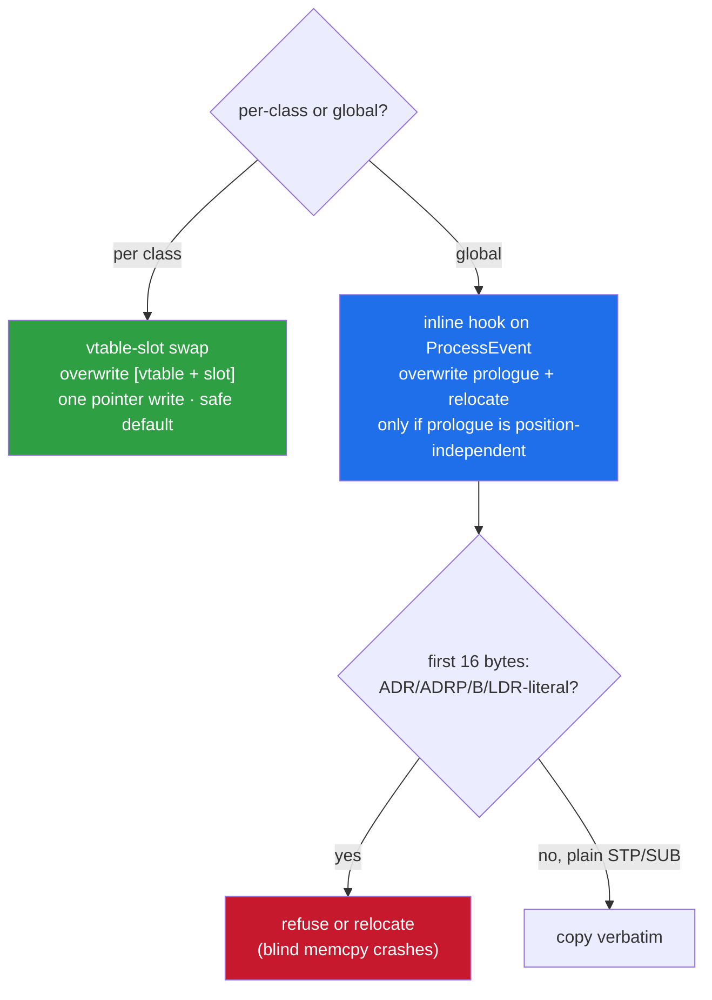

<h1 align="center">ue4-ios-processevent-notes</h1>

<p align="center">finding ProcessEvent in UE4 games on iOS (arm64) — the one funnel every UFunction call goes through</p>

<p align="center">
  
  
  
</p>

---

The stuff that actually works when the binary is 150 MB, stripped, and IDA's
auto-analysis bailed halfway through.

---

## contents

- [why you'd want it](#why-youd-want-it)
- [check this first or you'll waste an hour](#check-this-first-or-youll-waste-an-hour)
- [method 1 — follow an exec-thunk](#method-1--follow-an-exec-thunk-fastest-when-it-works)
- [method 2 — string + xref hunt](#method-2--string--xref-hunt-when-the-thunk-is-a-dead-end)
- [method 3 — read it off a live vtable](#method-3--read-it-off-a-live-vtable)
- [arm64 vs arm64e — check before you hook](#arm64-vs-arm64e--check-before-you-hook)
- [hooking it, short version](#hooking-it-short-version)
- [when not to bother](#when-not-to-bother)

---

## why you'd want it

`UObject::ProcessEvent(UFunction* fn, void* parms)` is the one funnel every UFunction
call goes through. Hook it once and you get every event by name plus its packed
parameter block — fire, RPCs, ability activations, all of it.



> More importantly it **survives game updates** — you match on the UFunction's name at
> runtime instead of a hardcoded offset that breaks the moment they ship a patch.

---

## check this first or you'll waste an hour

Before you go hunting, know the trap. On newer builds (especially networking-heavy
ones) net/exec functions are often **their own virtuals**. So a function's exec-thunk
ends like this:

```asm
LDR  X8, [X19]          ; X19 = this, X8 = vtable
LDR  X8, [X8, #0x550]   ; vtable + 0x550
BLR  X8
```

...and that `0x550` is **not necessarily ProcessEvent.** Easy to confirm — take two
different functions on the same class:

```asm
; ServerSendFireInfos:  LDR X8, [X8, #0x550]
; ServerSendHitInfos:   LDR X8, [X8, #0x538]
```



Different slots for two methods of the same class means these are **per-event
virtuals**, not a shared ProcessEvent. If everything went through one fixed slot, that
would be ProcessEvent. This decides your whole approach: a per-event slot is a more
surgical hook target, while the real ProcessEvent is universal but you have to
actually find it.

---

## method 1 — follow an exec-thunk (fastest when it works)

Every reflected function in the dump has an `// Offset:` — that's the exec-thunk. Grab
any `[Event]`/`[Net]` function and disassemble its thunk. The UE pattern is always the
same: marshal params onto the stack, then dispatch.

- if the dispatch is `this->vtable[N](this, &Params)` and `N` is the **same across a
  bunch of unrelated classes**, `N` is your ProcessEvent slot. Read it at runtime off
  any live object's vtable: `ProcessEvent = *(*(UObject*) + N)`.
- if `N` changes per function, you've got per-event virtuals (see above) — decide
  whether the per-event slot is what you actually want.

> [!IMPORTANT]
> Read the raw asm here, **don't trust the decompiler.** Hex-Rays on a half-analyzed
> thunk loves to invent `__swiftcall` and garbage arguments. Those three instructions
> above are unambiguous in disassembly.

---

## method 2 — string + xref hunt (when the thunk is a dead end)

`UObject::ProcessEvent` references a few distinctive strings for its script call-stack
/ stats scope — `"ProcessEvent"`, `"Script call stack"`, `"Accessed None"`. Find the
string, then find the `ADRP+ADD` that loads it:

```python
# IDAPython: find code referencing a string via ADRP+ADD, no xrefs needed
import ida_bytes

target = 0x0            # the string address
page, low = target & ~0xFFF, target & 0xFFF

def refs_to(lo, hi):
    ea = lo
    while ea < hi - 8:
        w = ida_bytes.get_dword(ea)
        if (w & 0x9F000000) == 0x90000000:            # ADRP
            immlo, immhi = (w >> 29) & 3, (w >> 5) & 0x7FFFF
            imm = (immhi << 2) | immlo
            if imm & (1 << 20):
                imm -= (1 << 21)                      # sign-extend 21 bits
            if (ea & ~0xFFF) + (imm << 12) == page:
                rd = w & 0x1F
                for k in range(1, 4):                 # ADD Xrd, Xrd, #low nearby
                    w2 = ida_bytes.get_dword(ea + 4 * k)
                    if (w2 & 0xFF800000) == 0x91000000 and (w2 & 0x1F) == rd \
                       and ((w2 >> 5) & 0x1F) == rd and ((w2 >> 10) & 0xFFF) == low:
                        yield ea
                        break
        ea += 4
```

The big function that references that string and takes `(this, UFunction*, void*)` is
ProcessEvent.

> [!TIP]
> A full scan over a 150 MB `__text` is slow, so **scope it.** UE's CoreUObject code
> clusters together, so once you've found one known CoreUObject function (any
> `UObject::` method) scan a few MB around it instead of the whole image.

---

## method 3 — read it off a live vtable

If you can attach a debugger or you already run in-process, skip the static hunt. Every
UObject shares the same ProcessEvent pointer in its vtable, so pull it from anything
you already hold a pointer to — `GWorld`, the local `PlayerController`, `GEngine`:

```cpp
uintptr_t pe = *(uintptr_t*)(*(uintptr_t*)liveUObject + kProcessEventSlot);
```

You still need the slot number, but you can get that from a per-event thunk you already
disassembled. The slot the game itself uses to dispatch is right there in the
instruction stream.

---

## arm64 vs arm64e — check before you hook

Read the Mach-O header, `cpusubtype` at offset 8:

| value | slice | implication |
|-------|-------|-------------|
| `0x00000000` | `CPU_SUBTYPE_ARM64_ALL`, plain arm64 | no pointer auth — vtable entries and function pointers are raw addresses, hook freely |
| `0x00000002` | arm64e | **PAC on** — vtable slots and the ProcessEvent pointer are signed; strip/authenticate before you call or patch. A raw jump to a signed pointer faults |

> [!NOTE]
> Plenty of current App Store UE4 games still ship a plain arm64 slice even on arm64e
> hardware. **Check, don't assume.**

---

## hooking it, short version

Two shapes that don't blow up:



- **vtable-slot swap (per class).** Overwrite `[classVtable + slot]` with your
  trampoline, keep the original to forward. One pointer write, no instruction
  relocation. The safe default.
- **inline hook on ProcessEvent itself (global).** Overwrite the prologue with a jump,
  relocate the stolen instructions into a trampoline. Only when the prologue is
  position-independent — plain `STP`/`SUB sp` frame setup is fine, but an
  `ADR`/`ADRP`/`B`/`LDR` (literal) in the first 16 bytes is not copyable verbatim and
  will crash if you blindly memcpy it. Refuse or relocate in that case.

In the hook, identify the event by reading the UFunction's own FName through
`FNamePool` and comparing to the name you want. No hardcoded addresses, survives
updates. (See my [FName notes](https://github.com/shiedless/ue4-ios-fname-notes) and
[inline-hook notes](https://github.com/shiedless/arm64-ios-inline-hook-notes).)

---

## when not to bother

> [!NOTE]
> If you only care about one specific event and it turned out to be a per-event virtual
> (method 1 showed different slots per function), just hook that class's slot directly.

Less code, more surgical, and you skip the whole ProcessEvent hunt. Keep ProcessEvent
for when you genuinely need to see everything going through the engine.

---

<p align="center">
  <sub><b>part 6 of 7</b> in the <a href="https://github.com/shiedless/ios-ue4-re">ios-ue4-re</a> series</sub><br>
  <sub>← <a href="https://github.com/shiedless/ue4-ios-fname-notes">ue4-ios-fname-notes</a> · <a href="https://github.com/shiedless/ios-ue4-re">index</a> · <a href="https://github.com/shiedless/tencent-ace-anogs-notes">tencent-ace-anogs-notes</a> →</sub>
</p>

---

<p align="center">— shiedless</p>
